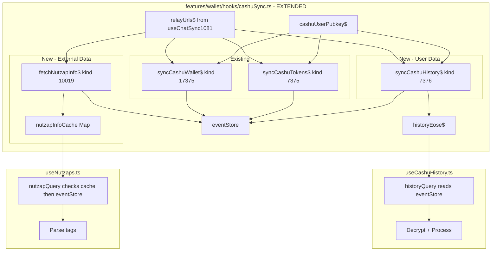

# Cashu History & Nutzap Migration to Applesauce Pattern

## Goal
Migrate `nostr.query()` calls in [`useCashuHistory.ts`](../features/wallet/hooks/useCashuHistory.ts:117) and [`useNutzaps.ts`](../features/wallet/hooks/useNutzaps.ts:33) to use the applesauce pattern established in [`cashuSync.ts`](../features/wallet/hooks/cashuSync.ts).

## Current State

### useCashuHistory.ts
- Uses `nostr.query()` at line 117 to fetch HISTORY events (kind 7376)
- Events are user's own spending history (append-only, not replaceable)
- Currently decrypts content using NIP-44
- Stores results in `transactionHistoryStore`

### useNutzaps.ts  
- Uses `nostr.query()` at line 33 to fetch ZAPINFO events (kind 10019)
- Fetches **other users' pubkeys** (not just logged-in user)
- Caches results in `nutzapStore`
- Kind 10019 is a replaceable event per NIP-01

## Target Architecture



---

## Implementation Details

### 1. Extend cashuSync.ts

Add the following to [`cashuSync.ts`](../features/wallet/hooks/cashuSync.ts):

#### 1.1 History Sync (User's own history - kind 7376)

```typescript
// EOSE tracking for history
export const historyEose$ = new BehaviorSubject<boolean>(false);

// Sync history events (kind 7376) - append-only events
export const syncCashuHistory$ = combineLatest([pubkeyDefined$, relaysDefined$]).pipe(
  tap(() => historyEose$.next(false)),
  switchMap(([pubkey, relays]) => {
    log("Syncing history for", pubkey.slice(0, 8));
    return relayPool
      .subscription(relays, { 
        kinds: [CASHU_EVENT_KINDS.HISTORY], 
        authors: [pubkey], 
        limit: 500 
      })
      .pipe(
        mergeMap((value: unknown) => {
          if (value === "EOSE") {
            log("History EOSE");
            historyEose$.next(true);
            return EMPTY;
          }
          return from([value as NostrEvent]);
        }),
        filter((e): e is NostrEvent => typeof e === "object" && e !== null && "id" in e),
        tap((e) => {
          log("History event:", e.id.slice(0, 8));
          eventStore.add(e);
        }),
        catchError((err) => {
          console.error("[cashuSync] History sync error:", err);
          historyEose$.next(true);
          return EMPTY;
        })
      );
  }),
  shareReplay(1)
);

// Helper to get history events from store
export const getCashuHistoryEvents = (pubkey: string) =>
  eventStore.getByFilters({ kinds: [CASHU_EVENT_KINDS.HISTORY], authors: [pubkey] });
```

#### 1.2 NutzapInfo Fetching (External users - kind 10019)

```typescript
import { Subject, firstValueFrom, timeout, catchError, of } from "rxjs";

// Cache for nutzap info events (keyed by pubkey)
const nutzapInfoCache = new Map<string, NostrEvent | null>();

// Subject for triggering nutzap info fetches
const nutzapInfoRequest$ = new Subject<string>();

/**
 * Fetch nutzap info for a pubkey using applesauce relayPool
 * Caches results in eventStore and local map
 */
export async function fetchNutzapInfo(
  pubkey: string,
  relays: string[]
): Promise<NostrEvent | null> {
  // Check cache first
  if (nutzapInfoCache.has(pubkey)) {
    log("NutzapInfo cache hit for", pubkey.slice(0, 8));
    return nutzapInfoCache.get(pubkey) ?? null;
  }

  // Check eventStore
  const cached = eventStore.getReplaceable(CASHU_EVENT_KINDS.ZAPINFO, pubkey);
  if (cached) {
    log("NutzapInfo eventStore hit for", pubkey.slice(0, 8));
    nutzapInfoCache.set(pubkey, cached);
    return cached;
  }

  log("Fetching NutzapInfo for", pubkey.slice(0, 8));

  try {
    // Subscribe and wait for first event or EOSE
    const event = await firstValueFrom(
      relayPool
        .subscription(relays, {
          kinds: [CASHU_EVENT_KINDS.ZAPINFO],
          authors: [pubkey],
          limit: 1,
        })
        .pipe(
          mergeMap((value: unknown) => {
            if (value === "EOSE") {
              // No event found
              return of(null);
            }
            return of(value as NostrEvent);
          }),
          filter((e): e is NostrEvent | null => 
            e === null || (typeof e === "object" && e !== null && "id" in e)
          ),
          timeout(10000), // 10 second timeout
          catchError((err) => {
            console.error("[cashuSync] NutzapInfo fetch error:", err);
            return of(null);
          })
        )
    );

    // Cache result
    nutzapInfoCache.set(pubkey, event);
    if (event) {
      eventStore.add(event);
    }

    return event;
  } catch (err) {
    console.error("[cashuSync] NutzapInfo fetch failed:", err);
    nutzapInfoCache.set(pubkey, null);
    return null;
  }
}

// Helper to get nutzap info from cache/store
export function getNutzapInfoEvent(pubkey: string): NostrEvent | null {
  // Check in-memory cache first
  if (nutzapInfoCache.has(pubkey)) {
    return nutzapInfoCache.get(pubkey) ?? null;
  }
  // Check eventStore
  return eventStore.getReplaceable(CASHU_EVENT_KINDS.ZAPINFO, pubkey) ?? null;
}

// Clear nutzap cache (useful on logout)
export function clearNutzapInfoCache(): void {
  nutzapInfoCache.clear();
}
```

#### 1.3 Update combined ready state

```typescript
// Combined ready state (update existing)
export const cashuSyncReady$ = combineLatest([
  walletEose$, 
  tokensEose$, 
  historyEose$
]).pipe(
  map(([w, t, h]) => w && t && h),
  distinctUntilChanged(),
  shareReplay(1)
);
```

---

### 2. Migrate useCashuHistory.ts

Key changes to [`useCashuHistory.ts`](../features/wallet/hooks/useCashuHistory.ts):

#### 2.1 Update imports

```typescript
// Remove this:
import { useNostr } from "@/hooks/useNostr";

// Add these:
import {
  syncCashuHistory$,
  historyEose$,
  getCashuHistoryEvents,
  cashuUserPubkey$,
} from "./cashuSync";
```

#### 2.2 Add sync activation

```typescript
// Add inside hook body, after other useState/useRef declarations
useEffect(() => {
  if (activeAccount?.pubkey) {
    cashuUserPubkey$.next(activeAccount.pubkey);
    const sub = syncCashuHistory$.subscribe();
    return () => sub.unsubscribe();
  }
}, [activeAccount?.pubkey]);
```

#### 2.3 Replace historyQuery queryFn (lines 93-193)

```typescript
queryFn: async () => {
  if (!activeAccount) throw new Error("User not logged in");
  if (!activeAccount.nip44) {
    throw new Error("NIP-44 encryption not supported by your signer");
  }

  // Wait for EOSE or timeout
  const waitForEose = () =>
    new Promise<void>((resolve) => {
      if (historyEose$.getValue()) return resolve();
      const sub = historyEose$.pipe(filter(Boolean)).subscribe(() => {
        sub.unsubscribe();
        resolve();
      });
      setTimeout(() => {
        sub.unsubscribe();
        resolve();
      }, 15000);
    });

  await waitForEose();

  // Get events from eventStore
  const events = getCashuHistoryEvents(activeAccount.pubkey);

  if (events.length === 0) {
    return [];
  }

  const history: (SpendingHistoryEntry & { id: string })[] = [];

  // KEEP ALL EXISTING DECRYPTION LOGIC (lines 126-189)
  for (const event of events) {
    try {
      let decrypted: string;
      try {
        decrypted = await activeAccount.nip44.decrypt(
          activeAccount.pubkey,
          event.content
        );
      } catch (error) {
        if (
          error instanceof Error &&
          error.message.includes("invalid MAC")
        ) {
          toast.error(
            "Nostr Extension: invalid MAC. Please switch to your previously connected account on the extension OR sign out and login."
          );
        }
        throw error;
      }
      const contentData = JSON.parse(decrypted) as Array<string[]>;

      const entry: SpendingHistoryEntry & { id: string } = {
        id: event.id,
        direction: "in",
        amount: "0",
        timestamp: event.created_at,
        createdTokens: [],
        destroyedTokens: [],
        redeemedTokens: [],
      };

      for (const item of contentData) {
        const [key, value] = item;
        const marker = item.length >= 4 ? item[3] : undefined;

        if (key === "direction") {
          entry.direction = value as "in" | "out";
        } else if (key === "amount") {
          entry.amount = value;
        } else if (key === "e" && marker === "created") {
          entry.createdTokens?.push(value);
        } else if (key === "e" && marker === "destroyed") {
          entry.destroyedTokens?.push(value);
        }
      }

      for (const tag of event.tags) {
        if (tag[0] === "e" && tag[3] === "redeemed") {
          entry.redeemedTokens?.push(tag[1]);
        }
      }

      history.push(entry);
      transactionHistoryStore.addHistoryEntry(entry);
    } catch (error) {
      console.error("Failed to decrypt history data:", error);
    }
  }

  return history.sort((a, b) => (b.timestamp || 0) - (a.timestamp || 0));
},
```

---

### 3. Migrate useNutzaps.ts

Key changes to [`useNutzaps.ts`](../features/wallet/hooks/useNutzaps.ts):

#### 3.1 Update imports

```typescript
// Remove this:
import { useNostr } from "@/hooks/useNostr";

// Add these:
import { fetchNutzapInfo, getNutzapInfoEvent } from "./cashuSync";
import { relayUrls$ } from "@/hooks/useChatSync1081";
```

#### 3.2 Replace useNutzapInfo queryFn (lines 23-77)

```typescript
export function useNutzapInfo(pubkey?: string) {
  const nutzapStore = useNutzapStore();
  const { config } = useAppContext();

  return useQuery({
    queryKey: ["nutzap", "info", pubkey],
    queryFn: async () => {
      if (!pubkey) throw new Error("Pubkey is required");

      // First check if we have it in the store
      const storedInfo = nutzapStore.getNutzapInfo(pubkey);
      if (storedInfo) {
        return storedInfo;
      }

      // Check eventStore cache
      let event = getNutzapInfoEvent(pubkey);

      // If not cached, fetch from relays using applesauce
      if (!event) {
        const relays = relayUrls$.getValue();
        if (relays.length === 0) {
          // Fallback to config relays
          event = await fetchNutzapInfo(pubkey, config.relayUrls);
        } else {
          event = await fetchNutzapInfo(pubkey, relays);
        }
      }

      if (!event) {
        return null;
      }

      // Parse the nutzap informational event
      const relays = event.tags
        .filter((tag) => tag[0] === "relay")
        .map((tag) => tag[1]);

      const mints = event.tags
        .filter((tag) => tag[0] === "mint")
        .map((tag) => {
          const url = tag[1];
          const units = tag.slice(2);
          return { url, units: units.length > 0 ? units : undefined };
        });

      const p2pkPubkeyTag = event.tags.find((tag) => tag[0] === "pubkey");
      if (!p2pkPubkeyTag) {
        throw new Error(
          "No pubkey tag found in the nutzap informational event"
        );
      }

      const p2pkPubkey = p2pkPubkeyTag[1];

      const nutzapInfo: NutzapInformationalEvent = {
        event,
        relays,
        mints,
        p2pkPubkey,
      };

      // Store the info for future use
      nutzapStore.setNutzapInfo(pubkey, nutzapInfo);

      return nutzapInfo;
    },
    enabled: !!pubkey,
  });
}
```

---

## Summary of Changes

| File | Action | Description |
|------|--------|-------------|
| [`cashuSync.ts`](../features/wallet/hooks/cashuSync.ts) | MODIFY | Add syncCashuHistory$, historyEose$, fetchNutzapInfo, nutzapInfoCache |
| [`useCashuHistory.ts`](../features/wallet/hooks/useCashuHistory.ts) | MODIFY | Remove useNostr, use historyEose$ + getCashuHistoryEvents |
| [`useNutzaps.ts`](../features/wallet/hooks/useNutzaps.ts) | MODIFY | Remove useNostr, use fetchNutzapInfo + getNutzapInfoEvent |

## Benefits

1. **Consistent pattern** - All Cashu-related syncing uses the same applesauce-based approach
2. **Event caching** - Events stored in eventStore for faster subsequent access
3. **EOSE-aware** - History sync waits for relay sync before processing
4. **Nutzap caching** - External user nutzap info cached to avoid redundant queries
5. **No useNostr** - Removes dependency on `@nostrify/react` for these hooks
6. **Reactive** - Can subscribe to sync observables for real-time updates

## Notes

- **History events are append-only**: Unlike wallet/token events, history events are not replaceable. The sync fetches all available events.
- **NutzapInfo is external**: Unlike other cashu data, nutzap info fetches OTHER users' data, hence the on-demand fetching with caching.
- **The createHistoryMutation** in useCashuHistory.ts already uses `relayPool.publish()` - no changes needed there.
- **The createNutzapInfoMutation** in useNutzaps.ts already uses `relayPool.publish()` - no changes needed there.
