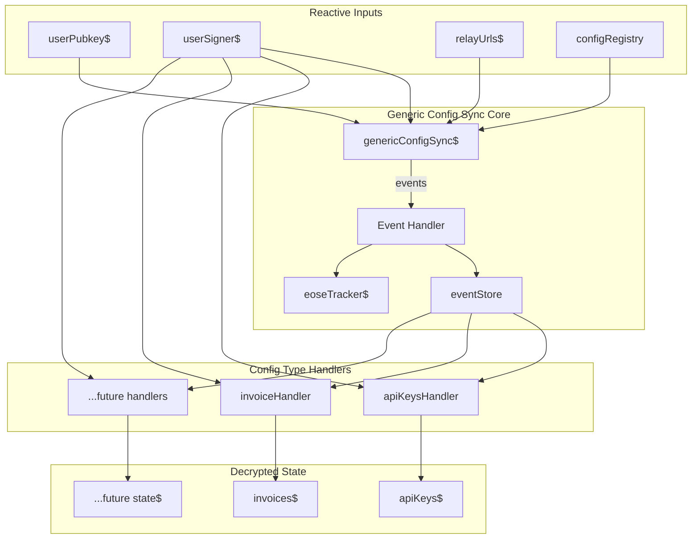
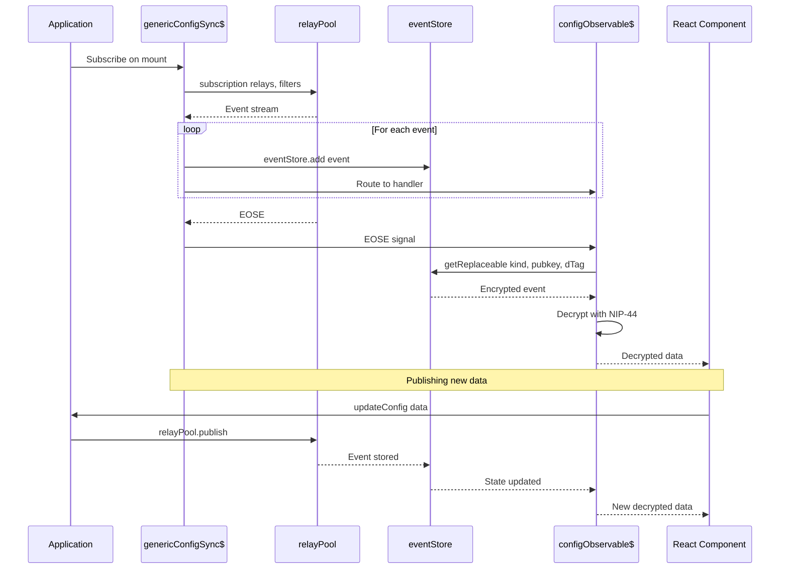

# Generic Config Sync System Architecture

## Overview

This document outlines the design for a generic, future-proof configuration sync system using applesauce that can fetch multiple Nostr event kinds and tags in a single observable subscription. This system will replace the current `useNostr`-based implementations in `useApiKeysSync.ts` and `useInvoiceSync.ts`.

## Current State Analysis

### Existing Implementations

1. **[`cashuSync.ts`](../features/wallet/hooks/cashuSync.ts)** - Already uses applesauce pattern
   - Uses `relayPool.subscription()` from `@/lib/applesauce-core`
   - Separate subscriptions for wallet (kind 17375) and tokens (kind 7375)
   - Stores events in `eventStore`
   - Tracks EOSE state via BehaviorSubjects

2. **[`sync1081Keyring.ts`](../hooks/sync/sync1081Keyring.ts)** - Uses applesauce pattern
   - Handles kind 1081 events with NIP-44 encryption
   - Uses `relayPool.subscription()` and `relayPool.publish()`

3. **[`useApiKeysSync.ts`](../hooks/useApiKeysSync.ts)** - Uses `useNostr` (needs migration)
   - Kind 30078 (NIP-78 arbitrary app data)
   - `d` tag: `routstr-chat-api-keys-v1`
   - NIP-44 encrypted content

4. **[`useInvoiceSync.ts`](../hooks/useInvoiceSync.ts)** - Uses `useNostr` (needs migration)
   - Kind 30078 (NIP-78 arbitrary app data)
   - `d` tag: `routstr-chat-invoices-v1`
   - NIP-44 encrypted content

### Key Requirements

1. **MUST use applesauce** - `relayPool` from `@/lib/applesauce-core`
2. **MUST NOT use `useNostr`** - Remove dependency on `@nostrify/react`
3. **Single subscription** - Fetch multiple kinds/tags in one observable
4. **Future-proof** - Easy to add new config types
5. **NIP-44 encryption** - Support encrypted content for sensitive data

## Proposed Architecture

### System Design



### Core Components

#### 1. Config Registry

A type-safe registry that defines all syncable config types:

```typescript
// hooks/sync/configRegistry.ts
export interface ConfigTypeDefinition<T = unknown> {
  /** Unique identifier for this config type */
  id: string;
  /** Nostr event kind */
  kind: number;
  /** The d tag value for replaceable events */
  dTag: string;
  /** Whether content is NIP-44 encrypted */
  encrypted: boolean;
  /** Parse/validate the decrypted content */
  parseContent: parsed: T => T | null;
  /** Default value when no event exists */
  defaultValue: T;
}

export const CONFIG_TYPES = {
  API_KEYS: {
    id: api-keys,
    kind: 30078,
    dTag: routstr-chat-api-keys-v1,
    encrypted: true,
    parseContent: data => Array.isArray parseContent data ? data : null,
    defaultValue: [],
  },
  INVOICES: {
    id: invoices,
    kind: 30078,
    dTag: routstr-chat-invoices-v1,
    encrypted: true,
    parseContent: data => Array.isArray parseContent data ? data : null,
    defaultValue: [],
  },
  // Easy to add more config types here
} as const satisfies Record<string, ConfigTypeDefinition>;
```

#### 2. Generic Config Sync Observable

```typescript
// hooks/sync/genericConfigSync.ts
import { combineLatest, switchMap, tap, filter, mergeMap, EMPTY, from } from rxjs;
import { relayPool, eventStore } from @/lib/applesauce-core;
import { CONFIG_TYPES } from ./configRegistry;

// Build a single filter that fetches ALL config types
function buildConfigFilter userPubkey: string {
  // Group by kind for efficient filtering
  const kindMap = new Map<number, string[]>;
  
  Object.values CONFIG_TYPES.forEach config => {
    const dTags = kindMap.get config.kind || [];
    dTags.push config.dTag;
    kindMap.set config.kind, dTags;
  };

  // Create filter array - one filter per kind with all d tags
  return Array.from kindMap.entries.map kind, dTags => {
    kinds: [kind],
    authors: [userPubkey],
    #d: dTags,
  };
}

export const genericConfigSync$ = combineLatest[
  userPubkeyDefined$,
  relayUrlsDefined$,
].pipe
  tap => configSyncEose$.next false,
  switchMap userPubkey, relayUrls => {
    const filters = buildConfigFilter userPubkey;
    
    return relayPool.subscription relayUrls, ...filters.pipe
      mergeMap value => {
        if value === EOSE {
          configSyncEose$.next true;
          return EMPTY;
        }
        return from [value as NostrEvent];
      },
      filter e => typeof e === object && e !== null && id in e,
      tap event => {
        eventStore.add event;
        // Emit to per-type subjects for real-time updates
        routeEventToHandler event;
      },
    ;
  },
  shareReplay 1,
;
```

#### 3. Decrypted Config Observables

```typescript
// hooks/sync/configObservables.ts
import { combineLatest, map, switchMap, from } from rxjs;

// Generic factory to create decrypted config observable
export function createConfigObservable<T>
  configDef: ConfigTypeDefinition<T>,
  signerInfo$: Observable<UserSignerInfo>,
  pubkey$: Observable<string>
: Observable<T> {
  return combineLatest [signerInfo$, pubkey$, configSyncEose$].pipe
    filter [_, __, eose] => eose, // Wait for EOSE
    switchMap [signerInfo, pubkey] => {
      const event = eventStore.getReplaceable
        configDef.kind,
        pubkey,
        configDef.dTag
      ;
      
      if !event return of configDef.defaultValue;
      
      if configDef.encrypted {
        return from decryptEvent event, signerInfo.pipe
          map content => configDef.parseContent content ?? configDef.defaultValue,
        ;
      }
      
      return of configDef.parseContent JSON.parse event.content ?? configDef.defaultValue;
    },
    shareReplay 1,
  ;
}

// Pre-built observables for each config type
export const apiKeys$ = createConfigObservable
  CONFIG_TYPES.API_KEYS,
  userSignerDefined$,
  userPubkeyDefined$
;

export const invoices$ = createConfigObservable
  CONFIG_TYPES.INVOICES,
  userSignerDefined$,
  userPubkeyDefined$
;
```

#### 4. Publish Helper

```typescript
// hooks/sync/configPublish.ts
export async function publishConfig<T>
  configDef: ConfigTypeDefinition<T>,
  data: T,
  signerInfo: UserSignerInfo,
  relayUrls: string[]
: Promise<NostrEvent> {
  let content: string;
  
  if configDef.encrypted {
    content = await signerInfo.signer.nip44.encrypt
      signerInfo.pubkey,
      JSON.stringify data
    ;
  } else {
    content = JSON.stringify data;
  }

  const event = await signerInfo.signer.signEvent {
    kind: configDef.kind,
    content,
    tags: [[d, configDef.dTag]],
    created_at: Math.floor Date.now / 1000,
  };

  await relayPool.publish relayUrls, event;
  eventStore.add event;
  
  return event;
}
```

### Data Flow



### React Hook Wrappers

```typescript
// hooks/useApiKeysSyncV2.ts
import { useObservableState } from applesauce-react/hooks;
import { apiKeys$, publishConfig } from ./sync/configObservables;
import { CONFIG_TYPES } from ./sync/configRegistry;

export function useApiKeysSyncV2 {
  const apiKeys = useObservableState apiKeys$, [];
  const [isLoading, setIsLoading] = useState true;
  
  // Subscribe to EOSE to know when loading is done
  useEffect  => {
    const sub = configSyncEose$.subscribe eose => setIsLoading !eose;
    return  => sub.unsubscribe;
  }, [];

  const createOrUpdateApiKeys = useCallback async keys: StoredApiKey[] => {
    const signerInfo = userSigner$.getValue;
    const relayUrls = relayUrls$.getValue;
    if !signerInfo || !relayUrls.length throw new Error Not ready;
    
    await publishConfig CONFIG_TYPES.API_KEYS, keys, signerInfo, relayUrls;
  }, [];

  return {
    syncedApiKeys: apiKeys,
    isLoadingApiKeys: isLoading,
    createOrUpdateApiKeys,
    // ... other methods
  };
}
```

## File Structure

```
hooks/
├── sync/
│   ├── configRegistry.ts      # Config type definitions
│   ├── configSyncInputs.ts    # Shared reactive inputs pubkey, signer, relays
│   ├── genericConfigSync.ts   # Main sync observable
│   ├── configObservables.ts   # Per-config decrypted observables
│   ├── configPublish.ts       # Publish helper functions
│   └── index.ts               # Exports
├── useApiKeysSyncV2.ts        # React hook wrapper migrated
├── useInvoiceSyncV2.ts        # React hook wrapper migrated
└── ... existing files
```

## Implementation Steps

### Phase 1: Core Infrastructure
1. Create `hooks/sync/configRegistry.ts` with type definitions
2. Create `hooks/sync/configSyncInputs.ts` extending existing chatSyncInputs if needed
3. Create `hooks/sync/genericConfigSync.ts` with unified subscription
4. Create `hooks/sync/configPublish.ts` for publishing events

### Phase 2: Config Observables
5. Create `hooks/sync/configObservables.ts` with factory and pre-built observables
6. Add EOSE tracking and error handling

### Phase 3: Migrate Hooks
7. Create `hooks/useApiKeysSyncV2.ts` using new system
8. Create `hooks/useInvoiceSyncV2.ts` using new system
9. Update components to use new hooks

### Phase 4: Cleanup
10. Remove `useNostr` calls from migrated hooks
11. Update imports throughout the application
12. Add tests for new functionality

## Benefits of This Approach

1. **Single Subscription**: All config types fetched in one relay subscription
2. **Future-Proof**: Adding new config types only requires updating `CONFIG_TYPES`
3. **Type-Safe**: Full TypeScript support with generics
4. **Reactive**: Real-time updates when events are received
5. **Consistent**: Same pattern as cashuSync and other applesauce-based code
6. **Efficient**: Uses eventStore for caching, avoids redundant network requests

## Questions for Clarification

1. Should the existing `chatSyncInputs.ts` be reused, or create separate inputs for config sync?
2. Should we support non-replaceable events in addition to NIP-78 replaceable events?
3. Do you want the migration to be backwards-compatible with existing localStorage data?
4. Should we add automatic retry/reconnection logic to the subscription?
