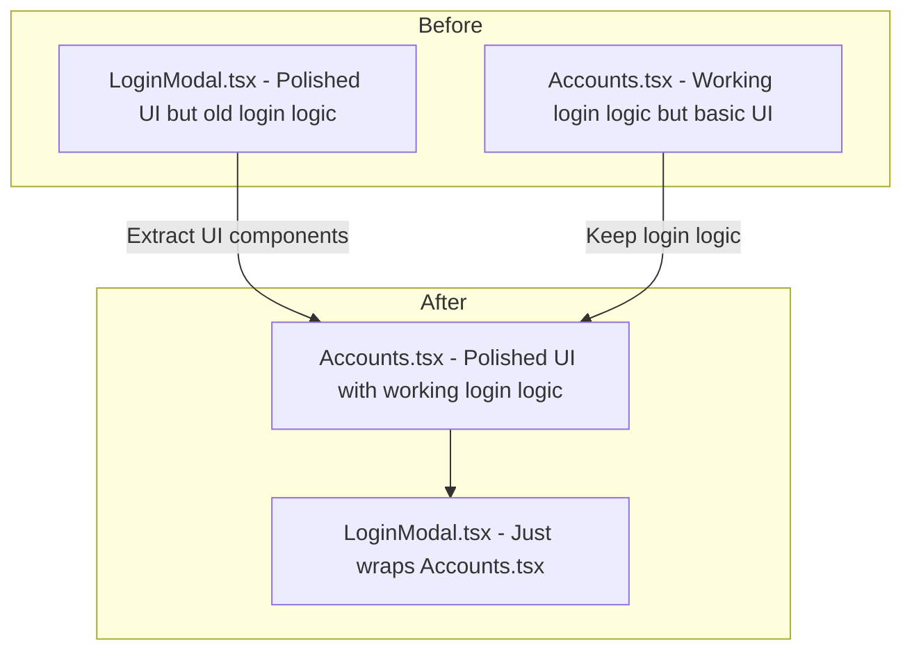

# Login System Migration: UI Redesign for Accounts.tsx

## Overview

**New Approach:** Instead of modifying `LoginModal.tsx` to use applesauce-accounts logic, we will update [`Accounts.tsx`](components/Accounts.tsx) with the polished dark UI from [`LoginModal.tsx`](components/LoginModal.tsx). This keeps the logic simple since `Accounts.tsx` already implements all login methods correctly.

## Current State

### LoginModal.tsx (Old System - To Be Replaced)
- Uses `@nostrify/react` hooks (`useLoginActions`, `useLoggedInAccounts`)
- Has polished dark UI with:
  - Welcome section with feature bullets
  - Two-panel layout (Create Account / Sign In)
  - Mobile-responsive tabs
  - Key generation with save confirmation flow
  - Bunker URL and QR code login support

### Accounts.tsx (New System - Already Working)
- Uses `applesauce-accounts` library correctly
- Has all login methods implemented:
  - Extension login
  - Private key login (import existing)
  - Generate new private key
  - Bunker URL login (NostrConnect)
  - QR Code login (NostrConnect)
- UI is functional but uses DaisyUI card-based design

## New Migration Strategy

**Goal:** Take the polished UI from LoginModal.tsx and apply it to Accounts.tsx, keeping the applesauce-accounts logic intact.



## Implementation Plan

### Step 1: Update Accounts.tsx with Polished UI

Replace the current DaisyUI card-based UI in `Accounts.tsx` with the dark theme UI from `LoginModal.tsx`:

**UI Structure to Implement:**
```
┌──────────────────────────────────────────────────────────────────┐
│  Welcome to Routstr Chat                                         │
│  A decentralized LLM routing marketplace                         │
│                                                                  │
│  ┌─────────────────────┐  ┌────────────────────────────────────┐ │
│  │   Create Account    │  │          Sign In                   │ │
│  │   New to Nostr?     │  │   Already have an account?         │ │
│  │                     │  │                                    │ │
│  │   • Multiple AI     │  │   [🔌 Browser Extension]           │ │
│  │   • Pay with BTC    │  │                                    │ │
│  │   • Private, open   │  │   ─── OR ───                       │ │
│  │   • Nostr + Cashu   │  │                                    │ │
│  │                     │  │   Private Key: [nsec1..] [Sign In] │ │
│  │   [Generate New     │  │                                    │ │
│  │    Identity]        │  │   ─── MORE OPTIONS ───             │ │
│  │                     │  │                                    │ │
│  └─────────────────────┘  │   [Bunker URL] [QR Code]           │ │
│                           └────────────────────────────────────┘ │
│                                                                  │
│  ┌────────────────────────────────────────────────────────────┐  │
│  │   Your Accounts (shown only if accounts.length > 1)        │  │
│  │   ┌─────────┐ ┌─────────┐ ┌─────────┐                      │  │
│  │   │ Account │ │ Account │ │ Account │                      │  │
│  │   │   1     │ │   2     │ │   3     │                      │  │
│  │   └─────────┘ └─────────┘ └─────────┘                      │  │
│  └────────────────────────────────────────────────────────────┘  │
└──────────────────────────────────────────────────────────────────┘
```

### Step 2: UI Components to Migrate

From `LoginModal.tsx`, extract and adapt:

1. **Welcome Section** (lines 294-302)
   - Title: "Welcome to Routstr Chat"
   - Subtitle: "A decentralized LLM routing marketplace"

2. **Create Account Panel** (lines 332-483)
   - Feature bullets
   - "Generate New Identity" button
   - Save keys step with:
     - Private key display (masked/revealed)
     - Copy button
     - Confirmation checkbox
     - "Complete Setup" / "I'll Save It Later" buttons

3. **Sign In Panel** (lines 485-665)
   - Browser Extension button with Shield icon
   - Private key input field
   - "MORE OPTIONS" section with:
     - Bunker URL toggle & input
     - QR Code toggle & display

4. **Mobile Tabs** (lines 304-328)
   - Toggle between Create/Sign In on mobile

5. **Error Display** (lines 668-675)
   - Red error message box

### Step 3: Keep Existing Logic from Accounts.tsx

Preserve the working login logic:

```typescript
// Extension login - already working
const handleExtensionLogin = useCallback(async () => {
  const account = await ExtensionAccount.fromExtension();
  manager.addAccount(account);
  manager.setActive(account);
}, [manager]);

// Generate new key - already working  
const createNewAccount = useCallback(() => {
  const account = PrivateKeyAccount.generateNew<AccountMetadata>();
  account.metadata = { name: `Account ${accounts.length + 1}` };
  manager.addAccount(account);
  manager.setActive(account);
}, [accounts.length, manager]);

// Private key import - already working
const handlePrivateKeyAccountCreated = useCallback(
  (account: PrivateKeyAccount<AccountMetadata>) => {
    manager.addAccount(account);
    manager.setActive(account);
  },
  [manager]
);

// Bunker/QR login - already working via handleSignerCreated
```

### Step 4: Add Conditional Accounts Section

Show accounts grid only when `accounts.length > 1`:

```tsx
{accounts.length > 1 && (
  <div className="mt-6 pt-6 border-t border-white/10">
    <h3 className="text-sm font-medium text-white/70 mb-4">Your Accounts</h3>
    <div className="grid grid-cols-1 md:grid-cols-2 lg:grid-cols-3 gap-4">
      {accounts.map((account) => (
        <AccountCard key={account.id} account={account} manager={manager} onSave={onSave} />
      ))}
    </div>
  </div>
)}
```

### Step 5: Update LoginModal.tsx

Simplify `LoginModal.tsx` to just wrap the updated `Accounts.tsx`:

```tsx
export default function LoginModal({ isOpen, onClose, onLogin, logout }: LoginModalProps) {
  const { manager, manualSave } = useAccountManager();
  
  if (!isOpen) return null;

  return (
    <div className="fixed inset-0 backdrop-blur-md bg-black/20 flex items-center justify-center z-50 p-4">
      <div className="bg-black/90 backdrop-blur-xl border-2 border-white/20 rounded-xl max-w-2xl w-full p-4 md:p-6 relative shadow-2xl max-h-[90vh] overflow-y-auto">
        <button onClick={onClose} className="absolute top-3 right-3 text-white/50 hover:text-white">
          {/* Close X */}
        </button>
        <AppleSauceLogin 
          manager={manager} 
          onSave={() => manualSave.next()} 
          onLogin={onLogin}
          onClose={onClose}
        />
      </div>
    </div>
  );
}
```

### Step 6: Update TopUpPromptModal.tsx

Already partially done. Complete the update to use `PrivateKeyAccount.generateNew()`:

```typescript
const createNsecForLogin = () => {
  const accounts = manager.accounts$.value;
  if (accounts.length > 0) return;
  
  const account = PrivateKeyAccount.generateNew<AccountMetadata>();
  manager.addAccount(account);
  manager.setActive(account);
  manualSave.next();
  markEphemeralNsecCreated();
};
```

## Files to Modify

| File | Changes |
|------|---------|
| [`components/Accounts.tsx`](components/Accounts.tsx) | Major UI overhaul - apply polished dark theme UI |
| [`components/LoginModal.tsx`](components/LoginModal.tsx) | Simplify to wrap Accounts.tsx |
| [`components/TopUpPromptModal.tsx`](components/TopUpPromptModal.tsx) | Already updated - verify working |

## Files to Remove

| File | Reason |
|------|--------|
| `hooks/useLoginActions.ts` | No longer needed - using applesauce-accounts |
| `hooks/useLoggedInAccounts.ts` | No longer needed - using applesauce-accounts |

## Style Guide

Use these classes for the dark theme:

```css
/* Container */
bg-black/90 backdrop-blur-xl border-2 border-white/20 rounded-xl

/* Headers */
text-white font-bold

/* Subtitles */
text-gray-400

/* Buttons - Primary */
bg-white text-black hover:bg-gray-100

/* Buttons - Secondary */
bg-white/10 border border-white/20 text-white hover:bg-white/20

/* Buttons - Ghost */
bg-white/5 border border-white/10 text-white/70 hover:bg-white/10 hover:text-white

/* Inputs */
bg-white/5 border border-white/10 rounded-lg text-white placeholder-gray-500 focus:border-white/30

/* Separators */
border-white/10

/* Error */
bg-red-500/10 border border-red-500/20 text-red-400
```

## Testing Checklist

- [ ] Extension login works
- [ ] Private key (nsec) import works
- [ ] Generate new key works
- [ ] Key copy/save flow works (masked display, copy button, confirmation)
- [ ] Bunker URL connection works
- [ ] QR code generation and connection works
- [ ] Account switching works (when multiple accounts)
- [ ] Account removal works
- [ ] Mobile responsive tabs work
- [ ] TopUpPromptModal ephemeral key creation works
- [ ] Accounts persist across refresh
- [ ] Active account restored correctly

## Notes

- The `AccountManager` singleton is in [`ClientProviders.tsx`](components/ClientProviders.tsx:35)
- Account persistence is handled in [`ClientProviders.tsx`](components/ClientProviders.tsx:97-124)
- The `manualSave.next()` triggers immediate save
- NostrConnect relay pool setup is in [`Accounts.tsx`](components/Accounts.tsx:14-21)
- `PrivateKeyAccount.generateNew()` creates a new key - no need to manually generate with nostr-tools
