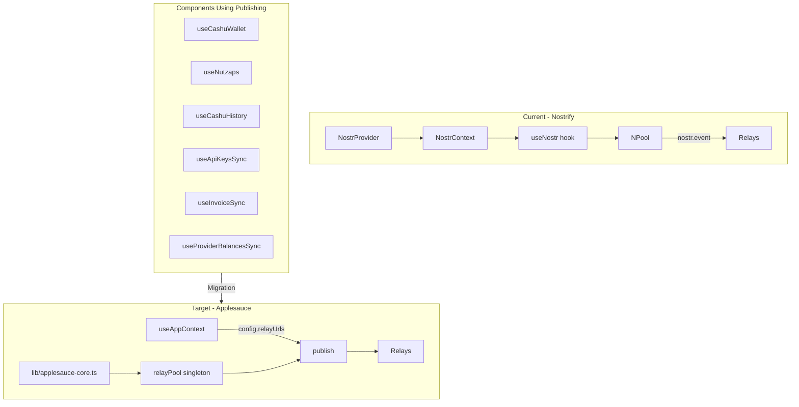

# Nostrify to Applesauce Migration Plan

## Overview

This plan documents the migration from Nostrify's `nostr.event()` method to applesauce's `relayPool.publish()` for publishing Nostr events.

## Current Architecture

### Nostrify (Being Phased Out)
- [`NostrProvider.tsx`](../components/NostrProvider.tsx) creates an `NPool` from `@nostrify/nostrify`
- [`useNostr()`](../hooks/useNostr.ts) hook from `@nostrify/react` provides access to `nostr` object
- `nostr.event(event)` publishes events using an internal `eventRouter` that returns `config.relayUrls`

### Applesauce (Target)
- [`lib/applesauce-core.ts`](../lib/applesauce-core.ts) exports singleton `relayPool` from `applesauce-relay`
- `relayPool.publish(relayUrls, event)` - requires explicit relay URL array
- Already used in [`sync1081Keyring.ts:174`](../hooks/sync/sync1081Keyring.ts:174)

### Relay URL Sources
- `relayUrls$` BehaviorSubject from [`chatSyncInputs.ts`](../hooks/sync/chatSyncInputs.ts)
- [`useAppContext()`](../hooks/useAppContext.ts) provides `config.relayUrls`

## Files Requiring Migration

8 usages of `nostr.event()` across 6 files:

| File | Line | Usage |
|------|------|-------|
| [`useCashuWallet.ts`](../features/wallet/hooks/useCashuWallet.ts) | 265 | Publish wallet event |
| [`useCashuWallet.ts`](../features/wallet/hooks/useCashuWallet.ts) | 514 | Publish token event |
| [`useCashuWallet.ts`](../features/wallet/hooks/useCashuWallet.ts) | 550 | Publish deletion event |
| [`useNutzaps.ts`](../features/wallet/hooks/useNutzaps.ts) | 136 | Publish nutzap info event |
| [`useCashuHistory.ts`](../features/wallet/hooks/useCashuHistory.ts) | 63 | Publish history event |
| [`useApiKeysSync.ts`](../hooks/useApiKeysSync.ts) | 61 | Publish API keys event |
| [`useInvoiceSync.ts`](../hooks/useInvoiceSync.ts) | 131 | Publish invoice event |
| [`useProviderBalancesSync.ts`](../hooks/useProviderBalancesSync.ts) | 84 | Publish balances event |

## Migration Pattern

For each file:

### Before (Nostrify)
```typescript
import { useNostr } from "@/hooks/useNostr";

function MyComponent() {
  const { nostr } = useNostr();
  
  // Publishing
  await nostr.event(signedEvent);
}
```

### After (Applesauce)
```typescript
import { relayPool } from "@/lib/applesauce-core";
import { useAppContext } from "@/hooks/useAppContext";

function MyComponent() {
  const { config } = useAppContext();
  
  // Publishing
  await relayPool.publish(config.relayUrls, signedEvent);
}
```

## Architecture Diagram



## Detailed Changes Per File

### 1. useCashuWallet.ts

```diff
- import { useNostr } from "@/hooks/useNostr";
+ import { relayPool } from "@/lib/applesauce-core";
+ import { useAppContext } from "@/hooks/useAppContext";

  function useCashuWallet() {
-   const { nostr } = useNostr();
+   const { config } = useAppContext();
  
    // Line 265 - createWalletMutation
-   await nostr.event(event);
+   await relayPool.publish(config.relayUrls, event);
  
    // Line 514 - updateProofsMutation
-   await nostr.event(newTokenEvent);
+   await relayPool.publish(config.relayUrls, newTokenEvent);
  
    // Line 550 - deletion event
-   await nostr.event(deletionEvent);
+   await relayPool.publish(config.relayUrls, deletionEvent);
  }
```

### 2. useNutzaps.ts

```diff
- import { useNostr } from "@/hooks/useNostr";
+ import { relayPool } from "@/lib/applesauce-core";
+ import { useAppContext } from "@/hooks/useAppContext";

  function useNutzaps() {
-   const { nostr } = useNostr();
+   const { config } = useAppContext();
  
    // Line 136
-   await nostr.event(event);
+   await relayPool.publish(config.relayUrls, event);
  }
```

### 3. useCashuHistory.ts

```diff
- import { useNostr } from "@/hooks/useNostr";
+ import { relayPool } from "@/lib/applesauce-core";
+ import { useAppContext } from "@/hooks/useAppContext";

  function useCashuHistory() {
-   const { nostr } = useNostr();
+   const { config } = useAppContext();
  
    // Line 63
-   await nostr.event(event);
+   await relayPool.publish(config.relayUrls, event);
  }
```

### 4. useApiKeysSync.ts

```diff
- import { useNostr } from "@/hooks/useNostr";
+ import { relayPool } from "@/lib/applesauce-core";
+ import { useAppContext } from "@/hooks/useAppContext";

  function useApiKeysSync() {
-   const { nostr } = useNostr();
+   const { config } = useAppContext();
  
    // Line 61
-   await nostr.event(event);
+   await relayPool.publish(config.relayUrls, event);
  }
```

### 5. useInvoiceSync.ts

```diff
- import { useNostr } from "@/hooks/useNostr";
+ import { relayPool } from "@/lib/applesauce-core";
+ import { useAppContext } from "@/hooks/useAppContext";

  function useInvoiceSync() {
-   const { nostr } = useNostr();
+   const { config } = useAppContext();
  
    // Line 131
-   await nostr.event(event);
+   await relayPool.publish(config.relayUrls, event);
  }
```

### 6. useProviderBalancesSync.ts

```diff
- import { useNostr } from "@/hooks/useNostr";
+ import { relayPool } from "@/lib/applesauce-core";
+ import { useAppContext } from "@/hooks/useAppContext";

  function useProviderBalancesSync() {
-   const { nostr } = useNostr();
+   const { config } = useAppContext();
  
    // Line 84
-   await nostr.event(event);
+   await relayPool.publish(config.relayUrls, event);
  }
```

## Post-Migration Cleanup

After all migrations are complete:

1. **Remove useNostr stub file**: [`hooks/useNostr.ts`](../hooks/useNostr.ts) can be removed or repurposed
2. **Evaluate NostrProvider**: Check if [`NostrProvider.tsx`](../components/NostrProvider.tsx) is still needed for other Nostrify features like subscriptions
3. **Remove @nostrify/react dependency**: If no longer used anywhere
4. **Update any documentation** referencing the old pattern

## Verification Steps

1. Run `npx tsc --noEmit` to check for type errors
2. Test each feature manually:
   - Create/update Cashu wallet
   - Update token proofs
   - Delete token events
   - Create nutzap info
   - Sync API keys
   - Sync invoices
   - Sync provider balances
3. Verify events are published to relays using a Nostr client

## Notes

- The `relayPool.publish()` method from applesauce requires explicit relay URLs, unlike Nostrify which uses router configuration
- All files already have access to `config.relayUrls` via `useAppContext()` or can easily import it
- The existing `eventStore.add(event)` calls should remain to keep local cache updated
