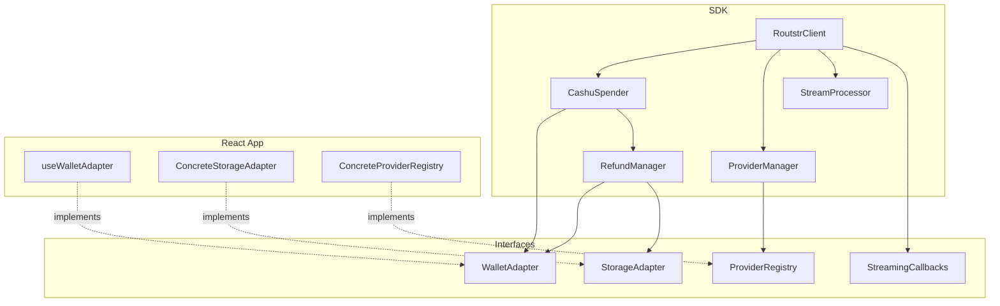

# Routstr SDK Extraction Plan

## Goal
Extract the core Routstr API interaction logic and Cashu spending logic into a reusable, framework-agnostic SDK. This will decouple the business logic from React hooks and UI components, making it easier to test, reuse, and maintain.

## Core Components to Extract

### 1. API Logic (`utils/apiUtils.ts`)
*   **Request Handling**: `routstrRequest` (token management, headers, retries).
*   **Error Handling**: `handleApiError` (402, 401, 500 handling, refund triggering).
*   **Provider Switching**: `findNextBestProvider` (failover logic).
*   **Streaming**: `processStreamingResponse` and `processNonStreamingResponse`.
*   **Main Flow**: `fetchAIResponse` (orchestration of the above).

### 2. Wallet Logic (`hooks/useCashuWithXYZ.ts` & `utils/cashuUtils.ts`)
*   **Spending Logic**: `spendCashu` (mint selection, balance checks, retries, critical section management).
*   **Refund Logic**: `unifiedRefund` (API call + wallet receive).
*   **Mint Selection**: `selectMintWithBalance`.

## Proposed Architecture

We will create a new directory `sdk/` with the following structure:

```
sdk/
├── index.ts              # Main barrel export
├── core/
│   ├── index.ts          # Barrel export
│   ├── types.ts          # Shared types (Message, Model, SpendResult, etc.)
│   └── errors.ts         # Custom error classes (InsufficientBalanceError, etc.)
├── wallet/
│   ├── index.ts          # Barrel export
│   ├── interfaces.ts     # WalletAdapter, StorageAdapter, ProviderRegistry
│   ├── CashuSpender.ts   # Core spending & refund logic
│   └── RefundManager.ts  # Refund-specific logic (extracted from cashuUtils)
├── client/
│   ├── index.ts          # Barrel export
│   ├── RoutstrClient.ts  # Main API client (extracted from apiUtils)
│   ├── ProviderManager.ts # Provider switching/failover logic
│   └── StreamProcessor.ts # Streaming response handling
└── utils/
    ├── index.ts          # Barrel export
    └── helpers.ts        # Shared utility functions
```

## Abstraction Strategy

To make the code reusable and independent of React, we need to abstract dependencies via interfaces:

### 1. WalletAdapter Interface
The React app implements this adapter using its hooks. The SDK uses it for wallet operations.

```typescript
interface WalletAdapter {
  /** Get balances for all mints (mintUrl -> balance in sats) */
  getBalances(): Promise<Record<string, number>>;
  
  /** Get unit type for each mint (mintUrl -> 'sat' | 'msat') */
  getMintUnits(): Record<string, string>;
  
  /** Get the currently active mint URL */
  getActiveMintUrl(): string | null;
  
  /** Create and send a cashu token from a mint */
  sendToken(mintUrl: string, amount: number, p2pkPubkey?: string): Promise<string>;
  
  /** Receive/store a cashu token (handles NIP-60 or legacy internally) */
  receiveToken(token: string): Promise<any[]>;
  
  /** Check if using NIP-60 wallet (for unit conversion decisions) */
  isUsingNip60(): boolean;
}
```

### 2. StorageAdapter Interface
Abstract local storage operations for token management.

```typescript
interface StorageAdapter {
  /** Get stored API token for a provider */
  getToken(baseUrl: string): string | null;
  
  /** Store API token for a provider */
  setToken(baseUrl: string, token: string): void;
  
  /** Remove API token for a provider */
  removeToken(baseUrl: string): void;
  
  /** Get all stored tokens as distribution (baseUrl -> amount) */
  getPendingTokenDistribution(): Array<{ baseUrl: string; amount: number }>;
}
```

### 3. ProviderRegistry Interface
Provides access to provider/model data for failover logic.

```typescript
interface ProviderRegistry {
  /** Get all models available from a provider */
  getModelsForProvider(baseUrl: string): Model[];
  
  /** Get list of disabled provider URLs */
  getDisabledProviders(): string[];
  
  /** Get mints accepted by a provider */
  getProviderMints(baseUrl: string): string[];
  
  /** Get provider info (version, etc.) */
  getProviderInfo(baseUrl: string): Promise<ProviderInfo | null>;
  
  /** Get all providers with their models */
  getAllProvidersModels(): Record<string, Model[]>;
}
```

### 4. StreamingCallbacks Interface
Callbacks for real-time updates during API calls.

```typescript
interface StreamingCallbacks {
  onStreamingUpdate: (content: string) => void;
  onThinkingUpdate: (content: string) => void;
  onMessageAppend: (message: Message) => void;
  onBalanceUpdate: (balance: number) => void;
  onTransactionUpdate: (transaction: TransactionHistory) => void;
  onTokenCreated?: (amount: number) => void;
  onPaymentProcessing?: (isProcessing: boolean) => void;
  onLastMessageSatsUpdate?: (satsSpent: number) => void;
}
```

## Implementation Steps

### Phase 1: Setup & Interfaces
1. Create the SDK directory structure with barrel exports.
2. Define all interfaces in `sdk/wallet/interfaces.ts`.
3. Move/define shared types to `sdk/core/types.ts`.
4. Create custom error classes in `sdk/core/errors.ts`.

### Phase 2: Extract Wallet Logic
5. Create `CashuSpender` class in SDK.
6. Migrate `spendCashu` logic from `useCashuWithXYZ.ts` to `CashuSpender`.
   * Replace hook calls with `WalletAdapter` calls.
   * Handle state updates via return values (not callbacks).
7. Create `RefundManager` and migrate `unifiedRefund` logic.
   * Uses `WalletAdapter.receiveToken` for token storage.
   * Uses `StorageAdapter` for token retrieval/removal.

### Phase 3: Extract API Logic
8. Create `StreamProcessor` class for streaming response handling.
9. Create `ProviderManager` class for failover logic.
   * Migrate `findNextBestProvider` logic.
   * Uses `ProviderRegistry` for model/provider data.
10. Create `RoutstrClient` class as the main entry point.
    * Inject `CashuSpender`, `StorageAdapter`, `ProviderRegistry`.
    * Migrate `routstrRequest` and `fetchAIResponse`.
    * Accept `StreamingCallbacks` for real-time updates.

### Phase 4: Integration
11. Create a concrete implementation of `WalletAdapter` in the React app (e.g., `useWalletAdapter` hook) that wraps the existing hooks.
12. Create concrete implementation of `StorageAdapter` wrapping `storageUtils.ts` functions.
13. Create concrete implementation of `ProviderRegistry` wrapping localStorage model cache.
14. Update `useCashuWithXYZ.ts` to instantiate and use `CashuSpender`.
15. Update `apiUtils.ts` (or call sites) to use `RoutstrClient`.

## Key Considerations

### State Management
The SDK should be stateless where possible. React state updates (like `setBalance`) should happen by reacting to the SDK's return values, not via callbacks injected into the SDK.

### Circular Dependencies
The current code has `apiUtils` importing `SpendCashuResult` from `useCashuWithXYZ`. The SDK structure resolves this by having all types defined in `sdk/core/types.ts`.

### Critical Sections
The `isSpendingCritical` ref in the hook prevents page unloads during sensitive operations. The SDK can expose a `isBusy` flag or use an event emitter pattern:

```typescript
class CashuSpender {
  private _isBusy = false;
  
  get isBusy(): boolean { return this._isBusy; }
  
  async spend(...): Promise<SpendResult> {
    this._isBusy = true;
    try {
      // ... spending logic
    } finally {
      this._isBusy = false;
    }
  }
}
```

### NIP-60 Abstraction
The SDK should not branch on `usingNip60` directly. Instead, the `WalletAdapter` implementation handles the difference internally. The SDK only needs to know the mint unit (`sat` vs `msat`) for amount calculations.

### Error Handling
Create specific error classes for common failure modes:

```typescript
class InsufficientBalanceError extends Error {
  constructor(public required: number, public available: number) {
    super(`Insufficient balance: need ${required} sats, have ${available}`);
  }
}

class ProviderError extends Error {
  constructor(public baseUrl: string, public statusCode: number, message: string) {
    super(message);
  }
}

class MintUnreachableError extends Error {
  constructor(public mintUrl: string) {
    super(`Mint ${mintUrl} is unreachable`);
  }
}
```

## Dependency Diagram


